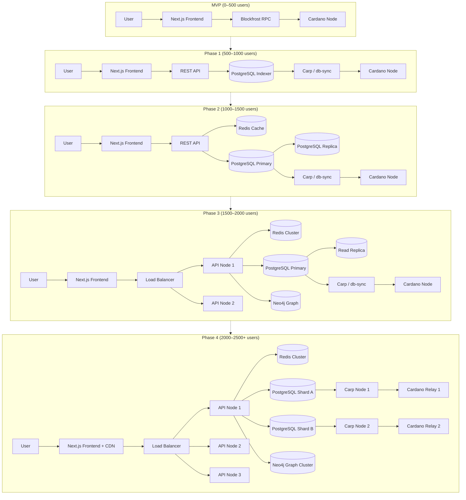
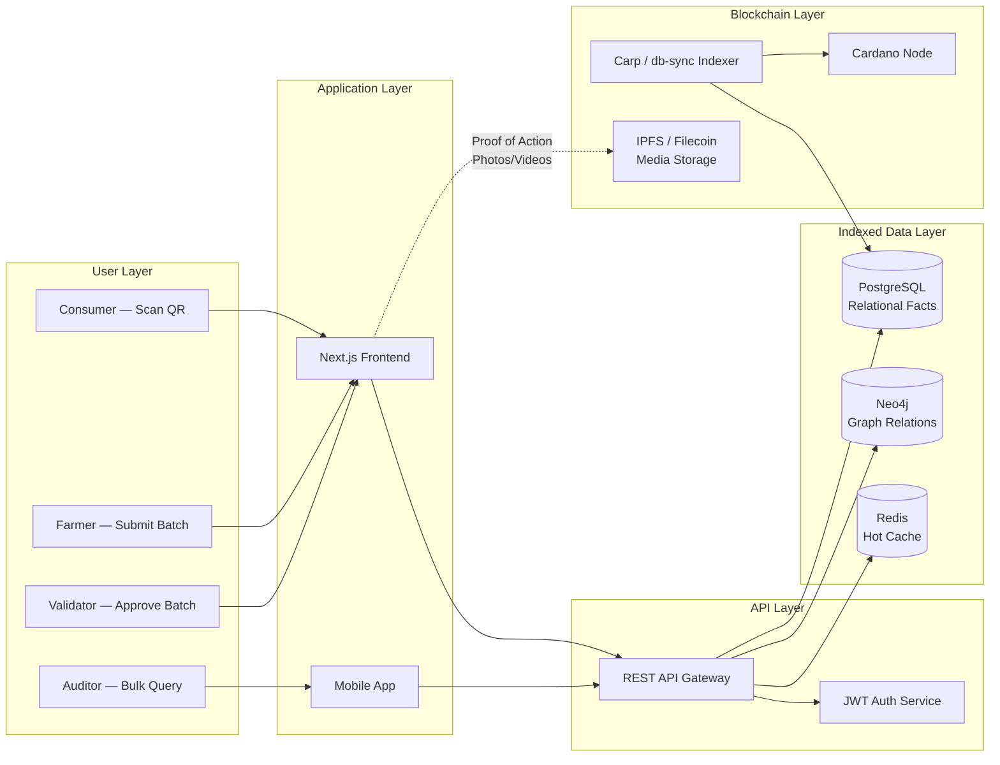

# TORO — Blockchain Scaling Technical Document

> **Trustless Oceanic Record of Origin**  
> On-chain seafood traceability on Cardano  
> **Scale Tiers:** 500 → 1000 → 1500 → 2000 → 2500 Users  
> **Date:** May 2026

---

## I. Scale System

### 1. Problem Statement

TORO is a **Cardano dApp** that traces tuna from catch/hatchery to can. Every product lookup requires reading multiple on-chain transactions (CIP-68 ref tokens with inline datums). In the current MVP, the frontend queries Blockfrost RPC directly for each trace request.

**Why RPC does not scale:**

| Issue | Impact |
|-------|--------|
| **Rate Limits** | Blockfrost free tier = 50,000 req/day. Paid tiers scale linearly in cost. |
| **Latency** | Each trace reads 5–9 transactions. Sequential RPC calls = 1.5–4s load time. |
| **Cost** | At 2,500 active users, RPC costs alone exceed $500/month with no performance guarantee. |
| **No Query Semantics** | UTxO model cannot answer "all batches from Farmer X in March" without scanning the entire chain. |
| **Graph Analytics Impossible** | Building a TrustGraph from raw RPC calls requires re-processing the entire chain on every analysis. |

**Solution Approach:** An **event-driven indexer layer** that listens to the Cardano chain, parses CIP-68 datums into a queryable database, and serves the frontend via a dedicated API. The blockchain becomes the *source of truth*; the indexer becomes the *queryable mirror*.

---

### 2. Scale Tier Matrix

Assumptions:  
- Average user performs **3 trace lookups per day**  
- Each trace reads **7 on-chain transactions** (5 stages + final product + metadata)  
- Each transaction read = **1 RPC call**

| Tier | Daily Users | Daily Lookups | Tx Reads / Day | RPC Calls / Day | Infrastructure Requirement |
|------|-------------|---------------|----------------|-----------------|---------------------------|
| **500** | 500 | 1,500 | 10,500 | ~10,500 | Blockfrost free tier. OK for MVP. Latency acceptable. |
| **1000** | 1,000 | 3,000 | 21,000 | ~21,000 | Free tier at 42% capacity. Latency becomes noticeable (2–3s). **Indexer required.** |
| **1500** | 1,500 | 4,500 | 31,500 | ~31,500 | Free tier exceeded. Paid Blockfrost ~$100/mo. Without indexer: 4s+ load times. **Indexer + Cache required.** |
| **2000** | 2,000 | 6,000 | 42,000 | ~42,000 | Paid tier costly. Need dedicated db-sync or Carp node. **Read replicas + Graph DB required.** |
| **2500** | 2,500 | 7,500 | 52,500 | ~52,500 | Enterprise scale. Multi-node setup. **Sharded DB + Load-balanced API cluster required.** |

---

### 3. Architecture Evolution Diagram



---

### 4. Tier-by-Tier Breakdown

#### Tier 1 — 500 Users (MVP)

**Approach:** Direct RPC  
**Infrastructure:** Blockfrost free tier (50K req/day)  
**Latency:** ~1.5s per trace lookup  
**Cost:** $0  
**Limitation:** No complex queries. Frontend reads each transaction individually. No graph analytics.

#### Tier 2 — 1000 Users (Indexer Required)

**Approach:** Introduce an **Indexer + PostgreSQL + REST API**  
**Infrastructure:**
- **Carp** (lightweight Cardano indexer) or **cardano-db-sync** (official but heavy)
- **PostgreSQL 15+** — stores parsed TraceDatum in relational tables
- **Node.js REST API** — serves the frontend; no direct RPC calls from client

**Why Carp over db-sync at this scale:**
- Carp is ~10x lighter on disk (50GB vs 500GB+)
- Faster sync time (hours vs days)
- Purpose-built for dApps that only need specific transaction types

**Latency:** ~200–400ms per trace lookup (cached queries hit <50ms)

**Cost:** ~$30–50/month (VPS + PostgreSQL)

#### Tier 3 — 1500 Users (Cache + Read Replicas)

**Approach:** Add **Redis caching** and **PostgreSQL read replicas**

**New Components:**
- **Redis** — caches hot batches (e.g., recently scanned products). TTL = 1 hour for trace data, 24 hours for metadata.
- **PostgreSQL Read Replica** — offloads read traffic from the primary indexer DB.
- **CDN** — static assets (product images, UI) served from edge locations.

**Cache Strategy:**
| Cache Key Pattern | TTL | Hit Rate |
|-------------------|-----|----------|
| `trace:{batch_id}` | 1 hour | ~70% |
| `batch:list:{station}` | 15 min | ~40% |
| `farmer:{id}:history` | 5 min | ~25% |

**Latency:** ~100–250ms (cache hit = <20ms)

**Cost:** ~$80–120/month

#### Tier 4 — 2000 Users (Graph Database + Multi-Node)

**Approach:** Add **Neo4j** for TrustGraph analytics and load-balance the API layer

**New Components:**
- **Neo4j Graph DB** — stores farmer-validator relationships for collusion detection, anomaly scoring, and link prediction.
- **API Load Balancer** — distributes read traffic across 2+ API nodes.
- **Background Workers** — process graph analytics asynchronously (e.g., nightly Louvain clustering, Adamic-Adar scoring).

**Data Flow:**
1. Indexer writes to PostgreSQL (relational facts)
2. Background job syncs farmer-validator edges to Neo4j (graph relationships)
3. API queries PostgreSQL for trace data, Neo4j for risk scores
4. Frontend receives both trace history and AI risk assessment in one request

**Latency:** ~80–150ms for trace data; ~300ms for trace + risk score

**Cost:** ~$200–300/month

#### Tier 5 — 2500 Users (Enterprise Scale)

**Approach:** **Database sharding** + **multi-region indexers**

**New Components:**
- **PostgreSQL Sharding** — split by geography (Asia batches vs. Global batches) or by batch ID range.
- **Redis Cluster** — distributed cache across nodes.
- **Neo4j Cluster** — causal clustering for graph analytics HA.
- **Multi-Node Indexer** — Carp/db-sync instances connected to multiple Cardano relay nodes for redundancy.
- **CDN + Edge API** — API nodes deployed in regions close to users (SEA, EU, NA).

**Failover Strategy:**
- If primary Cardano relay is down → auto-switch to backup relay
- If primary indexer DB is down → read replicas promote to primary
- If Neo4j cluster node fails → remaining nodes elect new leader automatically

**Latency:** <100ms globally (with edge caching)

**Cost:** ~$400–600/month

---

## II. System Architecture Overview

### 1. High-Level Architecture



### 2. Component Responsibilities

| Component | Technology | Role |
|-----------|-----------|------|
| **Frontend** | Next.js 15 + React | User interface, QR scanning, trace visualization |
| **API Gateway** | Node.js / Express or Fastify | Rate limiting, auth, routing, response aggregation |
| **Auth Service** | JWT + Lucia / Auth.js | Off-chain identity linked to Cardano wallet (CIP-8 / CIP-30) |
| **PostgreSQL** | PostgreSQL 15+ | Primary indexed data store. Parsed TraceDatum, batch metadata, transaction history |
| **Neo4j** | Neo4j Community / Enterprise | TrustGraph storage. Farmer-validator edges, collusion clusters, risk scores |
| **Redis** | Redis 7+ | Hot cache for trace lookups, session storage, rate limit counters |
| **Indexer** | Carp or cardano-db-sync | Listens to Cardano chain, extracts CIP-68 datums, writes to PostgreSQL |
| **IPFS** | IPFS + Pinata / Filecoin | Decentralized storage for Proof-of-Action media (photos, videos, certs) |
| **Cardano Node** | cardano-node + ogmios | Source of truth. Only the indexer talks directly to the node. |

### 3. Operational Flow

**Step 01 — User scans a product QR code**
- Frontend reads batch ID from QR (e.g., `MOTN3042`)
- Frontend calls `GET /api/trace/{batch_id}`

**Step 02 — API serves from cache or database**
- API checks Redis: `trace:MOTN3042`
- Cache hit → return immediately (<20ms)
- Cache miss → query PostgreSQL for batch stages + metadata
- Write result to Redis with 1-hour TTL

**Step 03 — Risk score enrichment (optional)**
- If user requests "Verify Trust": API queries Neo4j for farmer's graph metrics
- Returns collusion risk, trust score, anomaly flags alongside trace data

**Step 04 — On-chain verification (audit mode)**
- For auditors/regulators: API returns tx hashes + merkle proofs
- Auditor can independently verify on Cardanoscan without trusting the indexer

**Step 05 — Farmer submits new batch stage**
- Farmer uploads Proof-of-Action media → stored on IPFS, hash recorded
- Farmer signs transaction with wallet (CIP-30)
- Frontend submits to backend → backend assembles + submits to Cardano
- Indexer detects new transaction → updates PostgreSQL + invalidates Redis cache

---

## III. Core Technology Architecture

### 1. The Indexer — Why It Is Non-Negotiable

The indexer is the **heart of TORO's scalability**. Without it, every user query becomes an O(n) chain scan.

**What the indexer does:**
1. Connects to a Cardano node via a local relay
2. Watches for transactions that mint/burn/spend TORO CIP-68 tokens
3. Parses the inline `TraceDatum` from each transaction
4. Maps the datum fields to relational tables in PostgreSQL
5. Maintains a `prev_tx` linked list so trace history is queryable in O(1) via SQL JOINs

**Indexer Choice Matrix:**

| Solution | Disk Size | Sync Time | Maintenance | Best For |
|----------|-----------|-----------|-------------|----------|
| **Blockfrost** | N/A (hosted) | Instant | None | MVP only |
| **Carp** | ~50GB | ~6 hours | Low | dApps, specific tx types |
| **db-sync** | ~500GB+ | ~2 days | Medium | Full chain analytics |
| **Koios** | N/A (hosted) | Instant | None | Mid-scale without infra |

**TORO Recommendation:**
- **500–1500 users:** Carp (self-hosted) or Koios (hosted API)
- **1500+ users:** Self-hosted Carp + PostgreSQL for cost control and data sovereignty

---

### 2. PostgreSQL Data Schema

The relational schema mirrors the Aiken `TraceDatum` types for O(1) trace reconstruction.

```sql
-- Batches are the top-level product units
CREATE TABLE batches (
    batch_id            TEXT PRIMARY KEY,        -- e.g., "MOTN3042"
    policy_id           TEXT NOT NULL,
    final_tx_hash       TEXT NOT NULL,
    total_cans          INT,
    farm_cans           INT,
    catch_cans          INT,
    batch_label         TEXT,
    packaging_date      DATE,
    distribution_center TEXT,
    created_at          TIMESTAMPTZ DEFAULT NOW()
);

-- Each stage in the supply chain
CREATE TABLE trace_stages (
    id            SERIAL PRIMARY KEY,
    batch_id      TEXT REFERENCES batches(batch_id),
    stage_type    TEXT NOT NULL CHECK (stage_type IN (
        'Hatchery', 'Nursery', 'Growout', 'HarvestTransport',
        'FarmProcessing', 'CatchIce', 'PortLanding',
        'TransportPlant', 'CatchProcessing'
    )),
    tx_hash       TEXT NOT NULL UNIQUE,
    prev_tx_hash  TEXT,
    station       TEXT NOT NULL CHECK (station IN ('A', 'B')),
    -- Common metadata stored as JSONB for flexibility
    metadata      JSONB NOT NULL,
    submitted_by  TEXT,  -- Wallet address
    submitted_at  TIMESTAMPTZ DEFAULT NOW()
);

-- Index for fast trace reconstruction
CREATE INDEX idx_trace_stages_batch ON trace_stages(batch_id);
CREATE INDEX idx_trace_stages_prev_tx ON trace_stages(prev_tx_hash);

-- Farmers and Validators (off-chain identity linked to wallet)
CREATE TABLE actors (
    wallet_address  TEXT PRIMARY KEY,
    actor_type      TEXT NOT NULL CHECK (actor_type IN ('farmer', 'validator')),
    name            TEXT,
    trust_score     DECIMAL(5,2) DEFAULT 50.00,  -- 0–100
    risk_score      DECIMAL(5,2) DEFAULT 0.00,
    created_at      TIMESTAMPTZ DEFAULT NOW()
);

-- Graph edges for TrustGraph analytics
CREATE TABLE actor_edges (
    id          SERIAL PRIMARY KEY,
    source_addr TEXT REFERENCES actors(wallet_address),
    target_addr TEXT REFERENCES actors(wallet_address),
    edge_type   TEXT NOT NULL CHECK (edge_type IN ('submits_to', 'verifies', 'colludes')),
    weight      DECIMAL(5,4) DEFAULT 1.0,
    tx_hash     TEXT,
    created_at  TIMESTAMPTZ DEFAULT NOW(),
    UNIQUE(source_addr, target_addr, edge_type)
);

-- IPFS media proofs (Proof of Action)
CREATE TABLE media_proofs (
    id          SERIAL PRIMARY KEY,
    stage_id    INT REFERENCES trace_stages(id),
    ipfs_hash   TEXT NOT NULL,
    media_type  TEXT NOT NULL CHECK (media_type IN ('image', 'video', 'document')),
    gps_lat     DECIMAL(10,8),
    gps_lon     DECIMAL(11,8),
    captured_at TIMESTAMPTZ,
    uploaded_at TIMESTAMPTZ DEFAULT NOW()
);
```

**Trace Reconstruction Query (O(1) with indexes):**

```sql
-- Reconstruct full supply chain for batch MOTN3042
WITH RECURSIVE chain AS (
    SELECT * FROM trace_stages
    WHERE batch_id = 'MOTN3042' AND prev_tx_hash IS NULL
    UNION ALL
    SELECT ts.* FROM trace_stages ts
    INNER JOIN chain c ON ts.prev_tx_hash = c.tx_hash
)
SELECT * FROM chain ORDER BY submitted_at;
```

---

### 3. Neo4j Graph Schema (TrustGraph)

The graph database stores **relationships** that PostgreSQL cannot query efficiently.

```cypher
// Nodes
(:Actor {wallet: "addr1...", type: "farmer", name: "Farm A", trust_score: 85})
(:Actor {wallet: "addr2...", type: "validator", name: "Val 1", trust_score: 92})
(:Batch {id: "MOTN3042", total_cans: 5440, risk_score: 25})
(:Stage {tx_hash: "abc...", type: "Hatchery"})

// Relationships
(a:Actor)-[:SUBMITS {weight: 1.0, tx_hash: "abc..."}]->(s:Stage)
(v:Actor)-[:VERIFIES {weight: 1.0, tx_hash: "abc..."}]->(s:Stage)
(s:Stage)-[:PART_OF]->(b:Batch)
(a1:Actor)-[:KNOWS {adamic_adar: 0.42}]->(a2:Actor)
```

**Graph Analytics Queries:**

```cypher
// Detect collusion cliques (Louvain community detection)
CALL gds.louvain.stream('actor-graph')
YIELD nodeId, communityId
RETURN gds.util.asNode(nodeId).name AS actor, communityId
ORDER BY communityId;

// Adamic-Adar similarity between a farmer and validator
MATCH (f:Actor {type: "farmer"})-[:SUBMITS|VERIFIES]->(s:Stage)<-[:VERIFIES|SUBMITS]-(v:Actor {type: "validator"})
RETURN f.name, v.name, count(s) AS shared_stages
ORDER BY shared_stages DESC;

// Anomaly: farmer with no graph connections (isolated node)
MATCH (a:Actor {type: "farmer"})
WHERE NOT (a)-[:SUBMITS|VERIFIES]->()
RETURN a.wallet AS suspicious_farmer;
```

---

### 4. Redis Caching Strategy

```
Key Structure:

trace:{batch_id}           -> full trace JSON (TTL: 1h)
batch:{batch_id}:meta      -> batch metadata (TTL: 24h)
actor:{wallet}:score       -> trust + risk scores (TTL: 5m)
graph:cluster:{community}  -> collusion cluster members (TTL: 15m)
rate:{ip}                  -> request rate limit counter (TTL: 1m)
session:{jwt}              -> user session (TTL: 24h)
```

**Cache Invalidation:**
- **Write-through:** Indexer writes to PostgreSQL, then deletes the matching Redis key.
- **Lazy loading:** API reads from Redis; on miss, queries DB and populates Redis.
- **Background warm:** A cron job pre-fetches popular batches into Redis every 10 minutes.

---

### 5. IPFS Media Storage

Farmers upload photos/videos as **Proof of Action**. Storing these on-chain is impossible (too expensive). Storing them on a centralized server contradicts TORO's zero-trust philosophy.

**Solution:** IPFS with pinning service (Pinata) or Filecoin.

| Field | On-Chain (Datum) | Off-Chain (IPFS) |
|-------|------------------|------------------|
| `supplier_profile_hash` | `QmSupplierProfile123` | The actual PDF/document |
| `feed_type_hash` | `QmFeedType456` | Feed specification sheet |
| `antibiotic_free_cert_hash` | `QmAntibioticFreeCert` | Lab test result scan |
| Media uploads | — | Raw photo/video files |

**Verification Flow:**
1. Auditor sees `QmXyz123` in the on-chain datum
2. Auditor fetches `https://ipfs.io/ipfs/QmXyz123`
3. Auditor hashes the downloaded file → must match the on-chain hash
4. If mismatch → proof tampered, batch flagged

---

### 6. Infrastructure Cost Projection

| Tier | Users | VPS | PostgreSQL | Redis | Neo4j | Blockfrost / Node | CDN | **Total / Month** |
|------|-------|-----|------------|-------|-------|-------------------|-----|-------------------|
| 500 | 500 | — | — | — | — | Free | — | **$0** |
| 1000 | 1,000 | $20 | $15 | — | — | — | $10 | **~$45** |
| 1500 | 1,500 | $40 | $30 | $15 | — | — | $15 | **~$100** |
| 2000 | 2,000 | $80 | $60 | $30 | $50 | $50 | $20 | **~$290** |
| 2500 | 2,500 | $120 | $100 | $50 | $100 | $100 | $30 | **~$500** |

*Note: Costs assume self-hosted infrastructure (Hetzner / DigitalOcean). Using managed services (AWS RDS, Neo4j Aura) increases costs 2–3x.*

---

## Appendix A: Why Not Just Use Blockfrost Forever?

| Metric | Blockfrost Only | Indexer Architecture |
|--------|-----------------|----------------------|
| **Latency** | 1.5–4s per trace | 50–200ms |
| **Complex Queries** | Impossible (no SQL/graph) | Full SQL + Cypher support |
| **Rate Limits** | 50K/day free, costly beyond | Unlimited (self-hosted) |
| **Graph Analytics** | Not possible | Native Neo4j |
| **Data Sovereignty** | Third-party dependency | Fully owned |
| **Offline Audits** | Requires live API | DB snapshot exportable |
| **Cost at 2,500 users** | ~$500+/mo | ~$500/mo with 10x better performance |

**Conclusion:** Blockfrost is perfect for the MVP and investor demo. An indexer is required for production scale.

---

## Appendix B: Technology Stack Summary

| Layer | Technology | Purpose |
|-------|-----------|---------|
| Frontend | Next.js 15, React, Tailwind CSS | User interface |
| API | Node.js + Fastify or Python + FastAPI | REST API gateway |
| Cache | Redis 7 | Hot data, sessions, rate limits |
| Relational DB | PostgreSQL 15+ | Indexed trace data, batch metadata |
| Graph DB | Neo4j 5+ | TrustGraph analytics, collusion detection |
| Indexer | Carp or cardano-db-sync | Chain → database sync |
| Media | IPFS + Pinata / Filecoin | Decentralized proof storage |
| Blockchain | Cardano (Preview → Mainnet) | Source of truth |
| Wallet | CIP-30 (Lace, Eternl, Yoroi) | User signing |

---

*Document version: 1.0*  
*For questions or updates, contact the TORO engineering team.*
