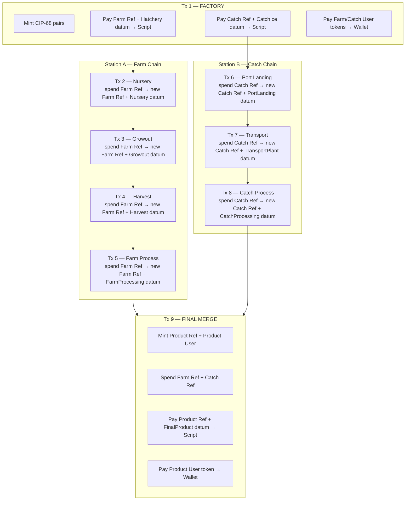
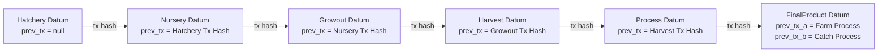
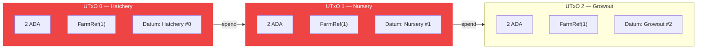
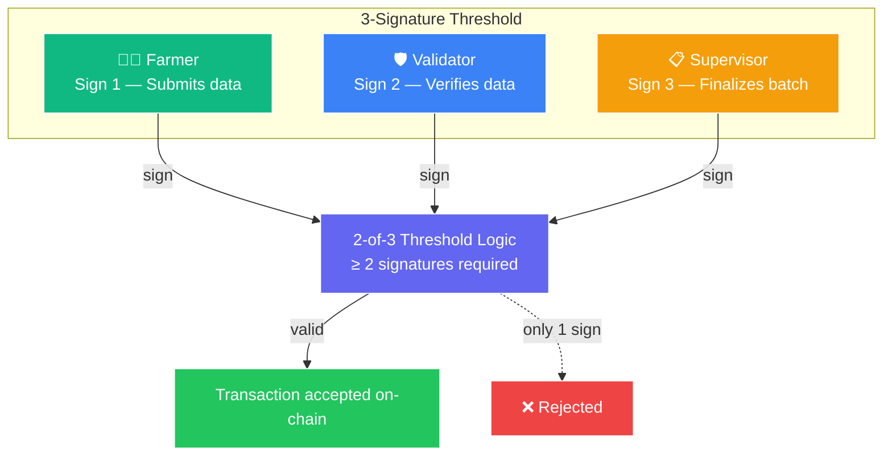

# TORO — Blockchain System Architecture

> Current on-chain design, contract structure, and off-chain interaction model.  
> **Network:** Cardano Preview Testnet  
> **Policy ID:** `def68337867cb4f1f95b6b811fedbfcdd7780d10a95cc072077088ea`  
> **Script Address:** `addr_test1wpunlryvl7aqsxe22erzlsseej87v5kk5vutvtrmzdy8dect48z0w`

---

## 1. System Overview

TORO uses a **two-layer on-chain architecture** for the investor demo:

```mermaid
flowchart LR
    subgraph OffChain["Off-Chain Layer (Lucid + Blockfrost)"]
        direction TB
        DW[Deployer Wallet<br/>Lace / Eternl]
        LS[Lucid TSX Scripts<br/>mock-flow.ts / deploy-testnet.ts]
        BF[Blockfrost RPC Gateway]

        DW -->|signs| LS
        LS -->|submit / query| BF
    end

    subgraph OnChain["On-Chain Layer (Cardano)"]
        direction TB

        subgraph Contracts["Smart Contracts"]
            direction TB
            MP[Minting Policy<br/>PlutusV3]
            TS[Trace Script<br/>PlutusV2 always-true]
            MP -->|mints CIP-68 pairs| TS
        end

        subgraph UTxOChain["UTxO Trace Chain"]
            direction LR
            H[Stage 1<br/>Hatchery]
            N[Stage 2<br/>Nursery]
            G[Stage 3<br/>Growout]
            HV[Stage 4<br/>Harvest]
            P[Stage 5<br/>Process]
            F[Stage N<br/>Final]

            H -->|spend + create| N
            N -->|spend + create| G
            G -->|spend + create| HV
            HV -->|spend + create| P
            P -->|spend + create| F
        end
    end

    OffChain --> OnChain
    BF -->|tx submission| MP
    BF -->|UTxO queries| TS
    TS -->|holds ref token + datum| H
```



**Key principle:** The blockchain is an **immutable audit log**, not a compute layer. All business logic (fraud detection, graph analytics, risk scoring) lives off-chain. The chain only stores **who did what, when, with cryptographic proof**.

---

## 2. Smart Contract Architecture

### 2.1 Minting Policy (`validators/toro.ak`)

```aiken
validator toro {
  mint(_redeemer: Data, _policy_id: PolicyId, _self: Transaction) {
    True
  }
}
```

| Property | Value |
|----------|-------|
| **Language** | Aiken v1.1.21 |
| **Plutus Version** | PlutusV3 |
| **Compiled Hash** | `def68337867cb4f1f95b6b811fedbfcdd7780d10a95cc072077088ea` |
| **Current Logic** | Permissive — always returns `True` |
| **Purpose** | Mints CIP-68 reference + user token pairs |

**Why permissive?**  
Aiken v1.1.21 has a known runtime crash when reading `self.extra_signatories`. This blocks on-chain signer verification. The investor demo works around this by enforcing authorization **off-chain** in the deploy script. Production would constrain the policy to check authorized signers and batch IDs.

### 2.2 Trace Script (Spending Validator)

```typescript
// PlutusV2 always-true CBOR
const ALWAYS_TRUE_CBOR = "4e4d01000033222220051200120011";
```

| Property | Value |
|----------|-------|
| **Type** | PlutusV2 script |
| **Logic** | Always succeeds — no on-chain validation |
| **Address** | `addr_test1wpunlryvl7aqsxe22erzlsseej87v5kk5vutvtrmzdy8dect48z0w` |
| **Purpose** | Holds CIP-68 ref tokens; carries inline `TraceDatum` |

**Why always-true?**  
Same Aiken limitation. The script's only job in the demo is to provide a **fixed address** where ref tokens live. In production, each station (Hatchery, Nursery, etc.) would have its own **parameterized validator** checking `extra_signatories` against an authorized signer list.

---

## 3. CIP-68 Token Design

TORO uses **CIP-68** (Token Metadata Standard) instead of CIP-25 (NFT Metadata) because CIP-68 allows **mutable, on-chain metadata** through reference tokens.

### 3.1 Token Pair Structure

Every batch creates **two tokens** under the same policy ID:

| Token | Asset Name Prefix | Hex Prefix | Purpose | Location |
|-------|------------------|------------|---------|----------|
| **Reference Token** | `000643b0` | `000643b0` | Carries inline `TraceDatum` metadata | Locked at script address forever |
| **User Token** | `000de140` | `000de140` | Tradeable NFT representing product ownership | Held in user's wallet |

**Example asset name (Farm batch):**
```
Policy ID:  def68337867cb4f1f95b6b811fedbfcdd7780d10a95cc072077088ea
Ref Token:  ...000643b0544f524f2d4641524d2d4d4f544e33303432
User Token: ...000de140544f524f2d4641524d2d4d4f544e33303432
                          └──────┘└────────┘└────────┘
                          prefix   TORO-FARM   MOTN3042
```

### 3.2 Why CIP-68?

| Feature | CIP-25 (Static NFT) | CIP-68 (Dynamic Ref Token) |
|---------|---------------------|---------------------------|
| Metadata location | Off-chain IPFS JSON | On-chain inline datum |
| Mutability | Immutable | Reference token datum updates with each stage |
| Traceability | One-time mint | Continuous UTxO chain |
| Verification | IPFS hash check | Direct datum decode |

For TORO, CIP-68 is essential because a tuna batch **evolves** — weight changes, location changes, processing stages. Each stage spends the previous ref-token UTxO and creates a new one with updated datum.

---

## 4. Transaction Flow

The full trace consists of **9 transactions** that form two independent chains merging into one final product.

### 4.1 Chain Structure



### 4.2 Stage-by-Stage Datum Evolution

Each transaction carries a **typed `TraceDatum`** as inline datum. The `prev_tx` field creates a **cryptographic linked list**:



This linked-list structure means:
1. **Tamper-proof:** Changing any stage's datum would change its tx hash, breaking all subsequent `prev_tx` links.
2. **Verifiable:** Anyone can reconstruct the full chain from the final UTxO by following `prev_tx` pointers backward.
3. **Independent audit:** An auditor only needs the final tx hash to trace back to the origin.

### 4.3 UTxO Flow (Visual)



Each stage **consumes** the previous UTxO and **creates** a new one at the same script address with the same ref token but updated datum. The ref token never leaves the script address until the Final transaction.

---

## 5. Off-Chain Architecture

### 5.1 Blockfrost Role

Blockfrost is the **RPC gateway** between the TypeScript deploy scripts and the Cardano network.

```mermaid
flowchart LR
    A[Lucid TSX Script] -->|HTTP POST| B[Blockfrost API]
    B -->|gRPC| C[Cardano Node]
    C --> D[(Blockchain)]

    B -.->|GET /addresses/{addr}/utxos| E["Query UTxOs"]
    B -.->|POST /tx/submit| F["Submit Tx"]
    B -.->|GET /txs/{hash}| G["Poll Confirmation"]
    B -.->|GET /epochs/latest/parameters| H["Fee Params"]

    A -.->|CIP-30| I[Lace / Eternl Wallet]
```

**What Blockfrost does for TORO:**

| Endpoint | Purpose | Usage |
|----------|---------|-------|
| `GET /addresses/{addr}/utxos` | Find ref-token UTxOs at script address | `advanceTrace()` looks up previous stage |
| `POST /tx/submit` | Submit signed CBOR transaction | Every stage submission |
| `GET /txs/{hash}` | Poll for confirmation | `waitForTx()` checks inclusion |
| `GET /epochs/latest/parameters` | Read fee parameters | Transaction building |

**Blockfrost limitations in current design:**
- No datum decoding API — datums are decoded client-side with Lucid's `Data.from()`
- No event streaming — scripts must poll for UTxO availability
- Rate limits apply (50K req/day free tier)

### 5.2 Lucid-Evolution Library

The off-chain stack uses **@lucid-evolution/lucid** (v0.4.30), a TypeScript library for building Cardano transactions.

**Key capabilities used:**

```typescript
// 1. Build and mint CIP-68 pairs
.newTx()
.mintAssets({ [farmRef]: 1n, [farmUsr]: 1n }, Data.void())
.attach.MintingPolicy(mintScript)

// 2. Pay to script with inline datum
.pay.ToContract(
  traceAddr,
  { kind: "inline", value: Data.to(datum) },
  { lovelace: 2_000_000n, [asset]: 1n }
)

// 3. Spend from script (always-true)
.collectFrom([prevUtxo], Data.void())
.attach.SpendingValidator(traceScript)

// 4. Sign with Lace wallet
.sign.withWallet()
.complete()
```

### 5.3 Script Toolkit

| Script | Purpose | Command |
|--------|---------|---------|
| `mock-flow.ts` | Full emulator run (9 txs, no real ADA) | `npm run mock` |
| `deploy-testnet.ts` | Deploy to Preview testnet | `npm run deploy` |
| `query-datums.ts` | Read all trace datums from script address | `npm run query` |
| `inspect-tx.ts` | Decode datum of any specific tx | `npx tsx inspect-tx.ts <hash>` |

---

## 6. Security Model

### 6.1 Current State (Demo)

| Layer | Current Implementation |
|-------|----------------------|
| **Minting** | Permissive — anyone can mint under the policy |
| **Spending** | Always-true — anyone can spend script UTxOs |
| **Signing** | Single deployer wallet ( Lace seed phrase ) |
| **Authorization** | Off-chain only — deploy script controls who submits |

**Risks in current demo:**
- If script address is public, anyone could spend the ref tokens
- No on-chain proof of who submitted a stage
- No slashing or penalty mechanism

### 6.2 Production Target: 3-Signature Threshold

The intended production security model uses a **3-party multi-sig** for each supply chain stage:



**Signature roles:**

| Signer | Role | Responsibility |
|--------|------|---------------|
| **Farmer** | Data origin | Submits Proof-of-Action, provides initial measurements |
| **Validator** | Independent verification | Cross-checks farmer data, visits site if needed |
| **Supervisor** | Final authority | Confirms batch ready for next stage, signs off on weights |

**Why 2-of-3 threshold?**
- Prevents single-party fraud (farmer cannot forge alone)
- Allows liveness if one party is offline (2 signatures still valid)
- Creates cryptographic evidence of multi-party consensus

**On-chain implementation (post-Aiken fix):**

```aiken
// Production minting policy (conceptual)
validator toro(authorized_signers: List<VerificationKeyHash>) {
  mint(_redeemer: Data, _policy_id: PolicyId, self: Transaction) {
    // Require ≥ 2 signatures from authorized_signers list
    let sig_count = list.count(authorized_signers, fn(signer) {
      list.has(self.extra_signatories, signer)
    })
    sig_count >= 2
  }
}
```

**Current workaround:**  
Until Aiken fixes the `extra_signatories` crash, signer enforcement is done **off-chain** in the deploy script. The deployer's Lace wallet is the only signer, simulating what would eventually be a multi-sig workflow.

---

## 7. Datum Schema Reference

All datums are **typed Aiken unions** with 10 constructors. Constructor index maps to stage type.

| Index | Constructor | Station | Key Fields |
|-------|-------------|---------|-----------|
| 0 | `Hatchery` | A | `batch_id`, `egg_weight_kg`, `hatchery_location`, `spawn_date`, `supplier_profile_hash` |
| 1 | `Nursery` | A | `prev_tx`, `fry_weight_kg`, `survival_rate_pct`, `pond_id`, `feed_type_hash` |
| 2 | `Growout` | A | `prev_tx`, `fish_weight_kg`, `density_per_m3`, `harvest_date`, `antibiotic_free_cert_hash` |
| 3 | `HarvestTransport` | A | `prev_tx`, `shipped_weight_kg`, `ice_temp_c`, `truck_id`, `arrival_time` |
| 4 | `FarmProcessing` | A | `prev_tx`, `input_weight_kg`, `output_cans`, `wastage_kg`, `supervisor_id` |
| 5 | `CatchIce` | B | `batch_id`, `catch_weight_kg`, `catch_location_latlon_hash`, `fishing_method`, `vessel_id`, `catch_date` |
| 6 | `PortLanding` | B | `prev_tx`, `landed_weight_kg`, `port_name`, `cold_storage_temp`, `quality_cert_hash` |
| 7 | `TransportPlant` | B | `prev_tx`, `shipped_weight_kg`, `container_id`, `transit_time_hours`, `storage_condition_hash` |
| 8 | `CatchProcessing` | B | `prev_tx`, `input_weight_kg`, `output_cans`, `wastage_kg`, `supervisor_id` |
| 9 | `FinalProduct` | Final | `prev_tx_a`, `prev_tx_b`, `total_cans`, `farm_cans`, `catch_cans`, `batch_label`, `packaging_date`, `distribution_center` |

**Key design decisions:**
- `prev_tx` stores the **previous transaction hash** as a ByteArray, creating the linked list
- All text fields are stored as UTF-8 hex in ByteArrays (e.g., `"TORO-FARM-001"` → `0x544f524f2d4641524d2d303031`)
- IPFS hashes (e.g., `QmSupplierProfile123`) are stored directly as strings for human readability on explorers

---

## 8. File Structure

```
contracts/toro/
├── validators/
│   └── toro.ak                  # Minting policy (Aiken)
├── lib/toro/
│   └── types.ak                 # TraceDatum union type (Aiken)
├── scripts/
│   ├── mock-flow.ts             # Local emulator (9 txs)
│   ├── deploy-testnet.ts        # Preview testnet deploy
│   ├── query-datums.ts          # Read all datums from script
│   └── inspect-tx.ts            # Decode single tx datum
├── plutus.json                  # Compiled blueprint (Aiken output)
├── deploy-manifest.json         # Last deploy output (tx hashes, tokens)
├── aiken.toml                   # Aiken project config
├── build.sh                     # `aiken build` wrapper
└── package.json                 # Lucid + TS dependencies
```

---

## 9. Known Limitations

| Issue | Impact | Workaround |
|-------|--------|------------|
| Aiken `extra_signatories` crash | Cannot verify signers on-chain | Off-chain signer enforcement in deploy script |
| Aiken `Address` comparison crash | Cannot check script address equality | Use always-true script |
| Always-true spending script | Anyone can spend ref tokens | Script address is not publicized; production uses parameterized validators |
| No on-chain slashing | No automatic penalty for fraud | Off-chain TrustGraph AI detects fraud; manual intervention required |
| Single deployer key | Centralized control | Production uses 2-of-3 multi-sig |

---

## Appendix: Current Testnet Deployment

From `deploy-manifest.json` (May 6, 2026):

```json
{
  "network": "Preview",
  "policyId": "def68337867cb4f1f95b6b811fedbfcdd7780d10a95cc072077088ea",
  "traceScriptAddress": "addr_test1wpunlryvl7aqsxe22erzlsseej87v5kk5vutvtrmzdy8dect48z0w",
  "transactions": {
    "mint": "b5aa6201abac8f47bac4fd0f9c8d22638afe6592b13808aff209162e722176ce",
    "final": "eca789f0602d513ca78c1154d406ac96404d4e224d084e778a80fa2769d0065b"
  }
}
```

**Explorer links:**
- Policy: https://preview.cardanoscan.io/tokenPolicy/def68337867cb4f1f95b6b811fedbfcdd7780d10a95cc072077088ea
- Script Address: https://preview.cardanoscan.io/address/addr_test1wpunlryvl7aqsxe22erzlsseej87v5kk5vutvtrmzdy8dect48z0w

---

*Document version: 1.0*  
*For contract updates, see `contracts/toro/README.md`*
